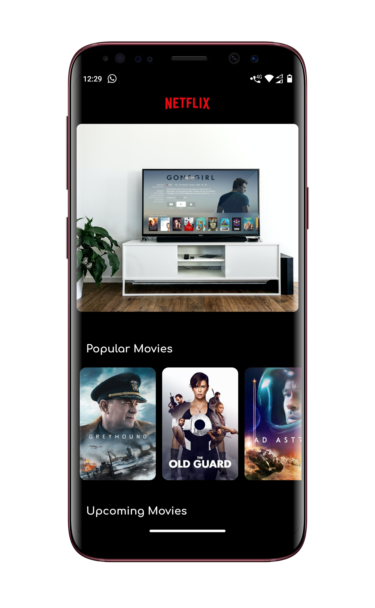
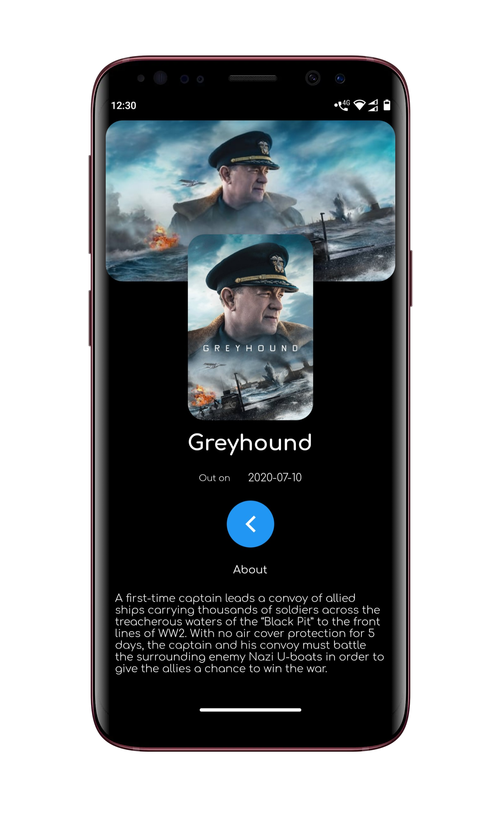

# Movie App

A new Flutter project which is used to get updated details about different movies across the world.

This application is supported both for Android and iOS platform. The data of different movies are fetched from "The MovieDB" API.

# Screenshot 

